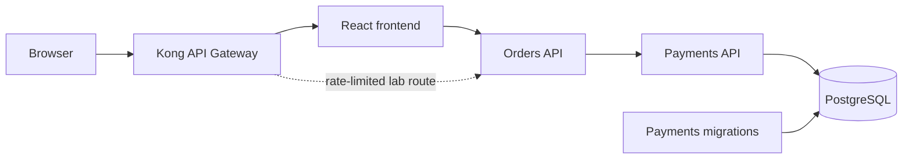

# MeshCommerce Integrated Platform

MeshCommerce is the shared project for the Full Cycle learning roadmap. It
turns the individual course topics into one evolving business and production
story that can be demonstrated without switching between unrelated sample
applications.

## Why one shared project?

The focused labs remain useful for learning one concept in isolation. The
shared project has a different purpose: prove how those concepts work together
in a realistic request flow and make each architectural decision explainable in
a technical conversation or interview.

We will not add a technology merely because it appears later in the roadmap.
Each new capability must follow the same sequence:

1. Observe a concrete problem in MeshCommerce.
2. Explain the concept that addresses that problem.
3. Implement the smallest useful change.
4. Validate the affected request flow.
5. Record the decision, trade-offs, and demo steps.

## Current business flow



- The frontend creates and lists orders through the Orders API.
- The Orders API owns the order workflow and requests a payment.
- The Payments API persists payments and enforces idempotency.
- The migrations executable evolves the payment schema before the API starts.
- PostgreSQL persists payments; orders are still stored in memory.

This boundary is intentional. Infrastructure can retry a request, but the
Payments API must guarantee that a retry does not create a duplicate charge.

## Current learning scope

The active scope contains only capabilities already covered or used as the
application baseline:

- a React frontend and two .NET APIs;
- service-to-service HTTP communication;
- PostgreSQL persistence and code-first migrations;
- multi-stage container images;
- Docker Compose networking, health checks, dependency ordering, and volumes;
- Kubernetes Deployments, Services, a StatefulSet, a migration Job,
  ConfigMaps, Secrets, probes, resource requests and limits, and persistent
  storage;
- Istio sidecar injection and circuit breaking with outlier detection;
- an intentionally faulty Payments instance for resilience experiments;
- Kong Ingress routing and a route-specific rate-limiting plugin;
- a Gateway screen that visualizes quotas and HTTP 429 decisions;
- versioned OpenAPI contracts for Orders and Payments;
- Spectral contract governance and Pull Request breaking-change detection;
- application CI with frontend quality checks, container builds, an integrated
  paid-order smoke test, and Kubernetes schema validation;
- Argo CD reconciliation with automated self-healing.
- a metrics preview with Prometheus, a provisioned Grafana Golden Signals
  dashboard, and an HTTP 5xx alert backed by Istio telemetry.

The local Docker Compose flow is the first executable baseline:

```text
Browser :4173
    -> Orders API :5101
        -> Payments API :5102
            -> PostgreSQL :5433
```

Inside the Compose network, containers use service DNS names and internal
ports. For example, Orders calls `http://payments-api:8080`; it does not use the
host port `5102`.

## Not active in the showcase yet

The following capabilities belong to future lessons and are not part of the
current validated showcase:

- gateway authentication and consumer-specific authorization;
- load testing with K6 or Testkube;
- centralized logs, distributed traces, OpenTelemetry instrumentation, durable
  telemetry storage, and custom business metrics.

## Validate the API contracts

The contracts are governed independently from the application runtime:

```bash
cd contracts
npm ci --ignore-scripts
npm run lint
```

Pull Requests that change the contracts or API source code run the same
Spectral rules. After the initial contracts exist on `main`, the pipeline also
uses `oasdiff` to reject removed operations, incompatible schema changes, and
other breaking changes. See [contracts/README.md](contracts/README.md) for the
ownership model, CI behavior, and current conformance boundary.

## Validate the application delivery path

Application and Kubernetes changes run independent CI gates before merge:

```text
Frontend lint and build ───────────────┐
Docker Compose build and smoke test ───┼─> CI quality gate
Kubernetes schema validation ──────────┘
                                           │
                                           v
                                    merge to main
                                           │
                                           v
                                  Argo CD reconciliation
```

The integrated job builds the existing multi-stage images, starts PostgreSQL,
runs the migration executable, checks both APIs and the frontend, and creates a
real order through `Orders.Api`. The gate succeeds only when `Payments.Api`
persists the payment and the order reaches `Paid`.

Kubeconform validates built-in resources in `final-project/kubernetes` against
the Kubernetes 1.36 schemas. The tool is pinned by container digest. Argo CD,
Istio, Kong, and Kind custom resources are explicitly reported as skipped
because their CRD schemas are not vendored in this repository; their admission
and controller behavior still require cluster-level validation.

GitHub Actions does not push changes directly into the local Kind cluster.
After a reviewed change reaches `main`, Argo CD pulls the desired state and
reconciles it. This keeps one deployment authority and separates CI validation
from pull-based CD.

## Preview application metrics

The observability preview reuses metrics already emitted by the Istio sidecars.
Prometheus discovers annotated MeshCommerce pods and Grafana loads a
version-controlled Golden Signals dashboard without manual setup.

```bash
./kubernetes/scripts/deploy-observability.sh
./kubernetes/scripts/observability-port-forward.sh
```

In another terminal, generate healthy and deliberately faulty traffic:

```bash
./kubernetes/scripts/generate-observability-traffic.sh
```

Open `http://localhost:14300/d/meshcommerce-golden-signals`. See
[kubernetes/observability/README.md](kubernetes/observability/README.md) for the
architecture, PromQL, alert runbook, security boundary, and deliberate limits.

## Run the current baseline

From this directory:

```bash
docker compose up --build -d
docker compose ps --all
```

Open the frontend:

```text
http://localhost:4173
```

Check the APIs:

```bash
curl --fail http://localhost:5101/health
curl --fail http://localhost:5102/health
curl --fail http://localhost:5101/orders
```

Create an order and exercise the complete Orders-to-Payments flow:

```bash
curl --fail-with-body \
  --request POST http://localhost:5101/orders \
  --header 'Content-Type: application/json' \
  --data '{"customer":"John","item":"Keyboard","amount":249.90}'
```

Stop the environment without deleting the PostgreSQL volume:

```bash
docker compose down
```

## Run the Kubernetes, Kong, Istio, and GitOps stack

The learned-only Kubernetes baseline now has a reproducible deployment command:

```bash
./kubernetes/scripts/deploy-local.sh
```

Expose the Kong proxy in a separate terminal:

```bash
./kubernetes/scripts/port-forward.sh
```

Open `http://localhost:14173`. The Orders view validates the application and
Kubernetes resources. The Operations view exercises the already-studied Istio
circuit breaker against healthy and intentionally faulty Payments instances.
The Gateway view sends a burst through the route-specific Kong rate limit and
shows allowed requests, remaining quota, reset time, and HTTP 429 responses.
When Argo CD is installed, the deployment script also restores the existing
MeshCommerce Application and its self-healing policy.

See [kubernetes/README.md](kubernetes/README.md) for the architecture,
prerequisites, validation commands, and deliberate scope boundaries.

## Evolution plan

The next API Gateway change will address a new concrete problem, such as client
identity and authentication. Later courses will continue evolving this same
request flow instead of creating another final application.

For implementation details, local-development commands, persistence behavior,
and the original evolution notes, see [README.md](README.md).
