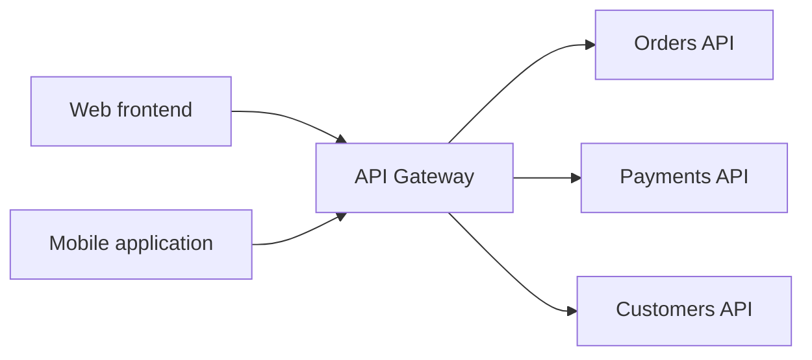

# API Gateway Architecture

## Architecture



The web frontend and mobile application are external clients. They communicate
with one public endpoint provided by the API Gateway instead of connecting to
each backend API directly.

The gateway examines each incoming request and selects a backend using routing
rules. For example:

```text
GET  /orders/123    -> Orders API
POST /payments      -> Payments API
GET  /customers/42  -> Customers API
```

The backend APIs can remain on private network addresses. Clients only need to
know the public address of the gateway, such as `https://api.company.com`.

## 1. What problem does the Gateway solve?

The API Gateway provides a single, controlled entry point for clients that need
to consume multiple backend APIs. It hides the internal network topology and
routes each request to the service responsible for that business capability.

It can also apply policies shared by multiple APIs before forwarding a request:

- authentication and initial authorization checks;
- TLS termination;
- rate limiting and quotas;
- request and response transformation;
- correlation IDs;
- access logs, metrics and tracing;
- routing between API versions;
- restrictions based on consumers, hosts, paths or HTTP methods.

The gateway should not own domain rules such as deciding whether an order may be
cancelled or whether a payment is valid. Those responsibilities belong to the
backend services. The gateway manages API traffic and cross-cutting policies,
not the core business logic.

## 2. Why should clients not know all three APIs directly?

If clients call every service directly, they become coupled to the internal
architecture. They must know service hostnames, ports, versions and route
structures. Moving or replacing a service could then require changes to every
web, mobile or partner client.

Direct exposure also increases the public attack surface. Every API would need
its own public endpoint, TLS configuration, firewall rules, authentication,
rate limiting and monitoring. Differences between those implementations could
create inconsistent behavior and security gaps.

With a gateway, the public contract can remain stable while the internal system
changes. For example, the gateway can keep exposing `/payments` while routing
traffic from `payments-v1` to `payments-v2`. Clients do not need to know that an
internal migration occurred.

The gateway therefore reduces client coupling, limits public exposure and gives
the platform a consistent place to enforce common traffic policies.

## 3. What could go wrong if the Gateway became unavailable?

External clients would lose their entry point and would be unable to reach the
APIs through the supported public route. The backend services might still be
healthy, but they would be inaccessible to those clients.

This makes a single gateway instance a single point of failure. A production
architecture should reduce this risk with:

- multiple gateway replicas;
- a load balancer in front of those replicas;
- readiness and liveness checks;
- replicas distributed across nodes or availability zones;
- rolling updates that preserve available instances;
- capacity, latency and error-rate monitoring;
- tested recovery and rollback procedures.

Centralizing traffic creates operational consistency, but it also creates a
critical component that must be designed for high availability and sufficient
capacity.
