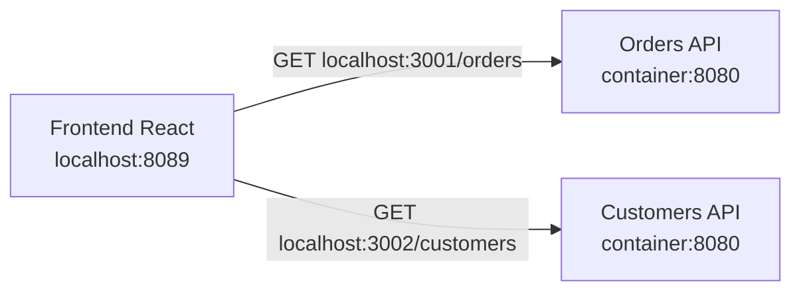

# Lab Fase 2 - Projeto-base sem Gateway

> **Reference lab:** this small two-API environment remains useful for isolated
> experiments. The active course and John-facing showcase now use
> [MeshCommerce](../../../final-project/SHOWCASE.md) as the shared
> project. New course capabilities should be implemented there after their
> corresponding lesson.

Este laboratório estabelece uma baseline funcional antes da instalação do
Kong. Primeiro provamos que cada API funciona diretamente. Na fase seguinte,
adicionaremos o Gateway e compararemos o novo caminho com essa baseline.

## Arquitetura atual



Ainda não existe entrada única. O cliente precisa conhecer o endereço de cada
API, que é exatamente o acoplamento que o Gateway resolverá posteriormente.

## Serviços e portas

| Serviço       | Responsabilidade   | Host             | Rede Docker          |
| ------------- | ------------------ | ---------------- | -------------------- |
| Orders API    | Consultar pedidos  | `localhost:3001` | `orders-api:8080`    |
| Customers API | Consultar clientes | `localhost:3002` | `customers-api:8080` |
| Frontend      | Visualizar tráfego | `localhost:8089` | `frontend:8080`      |

O mapeamento `3001:8080` significa que a porta `3001` do computador encaminha
tráfego para a porta `8080` do container. Dentro da rede Docker, outro container
não utiliza a porta do host: ele usa o nome DNS do serviço e a porta interna.

## Endpoints

### Orders API

| Método | Caminho   | Finalidade                  |
| ------ | --------- | --------------------------- |
| `GET`  | `/`       | Identidade e versão da API  |
| `GET`  | `/health` | Estado operacional          |
| `GET`  | `/orders` | Lista de pedidos em memória |

### Customers API

| Método | Caminho      | Finalidade                   |
| ------ | ------------ | ---------------------------- |
| `GET`  | `/`          | Identidade e versão da API   |
| `GET`  | `/health`    | Estado operacional           |
| `GET`  | `/customers` | Lista de clientes em memória |

## Executar com Docker Compose

Na pasta deste laboratório:

```bash
docker compose up --build -d
docker compose ps
```

Abra o painel em:

```text
http://localhost:8089
```

O seletor do painel executa caminhos de rede diferentes:

- **Direto** chama `localhost:3001/orders` e
  `localhost:3002/customers`. Este é o modo funcional desta fase.
- **Via Kong** chama `localhost:8000/orders` e
  `localhost:8000/customers`. Enquanto o Kong não existir, a falha exibida é o
  comportamento esperado, não uma resposta simulada pelo frontend.

Como o frontend e as APIs utilizam portas distintas, o navegador as considera
origens diferentes. As APIs liberam CORS apenas para as origens locais do Vite
(`5173`) e do container frontend (`8089`).

As duas imagens usam build multi-stage:

1. `dotnet/sdk` restaura e publica o projeto.
2. Apenas os arquivos publicados são copiados para `dotnet/aspnet`.
3. O processo final executa como usuário não privilegiado.

O frontend também usa build multi-stage: Node compila React/Vite e somente os
arquivos estáticos gerados seguem para a imagem final do Nginx.

Isso mantém compiladores e arquivos intermediários fora da imagem de runtime.

## Testar sem Gateway

```bash
curl --fail http://localhost:3001/health
curl --fail http://localhost:3001/orders

curl --fail http://localhost:3002/health
curl --fail http://localhost:3002/customers
```

Esses testes são nossa referência. Se continuarem funcionando e uma futura
requisição pelo Kong falhar, investigaremos primeiro rotas, upstreams, DNS e a
rede do Gateway.

## Executar diretamente com .NET

Os profiles gerados pelo template escolhem portas próprias. Para controlar as
portas durante o laboratório, desabilitamos o launch profile:

```bash
ASPNETCORE_URLS=http://127.0.0.1:3001 \
	dotnet run --project src/Orders.Api --no-launch-profile

ASPNETCORE_URLS=http://127.0.0.1:3002 \
	dotnet run --project src/Customers.Api --no-launch-profile
```

## Encerrar o ambiente

```bash
docker compose down
```

## Responsabilidade futura do Gateway

Na próxima fase, o Kong deverá:

- oferecer uma porta pública única;
- encaminhar `/orders` para Orders API;
- encaminhar `/customers` para Customers API;
- esconder os endereços internos dos clientes;
- criar um ponto comum para políticas como autenticação, rate limiting e logs.

As regras e os dados de pedidos e clientes continuarão pertencendo às APIs.
