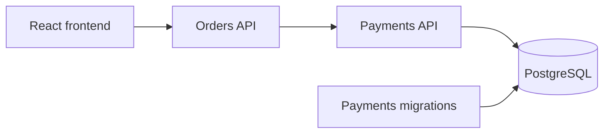

# MeshCommerce Integrated Platform

MeshCommerce is the shared project for the Full Cycle learning roadmap. It
turns the individual course topics into one evolving business and production
story that can be demonstrated without switching between unrelated sample
applications.

## Why one shared project?

The focused labs remain useful for learning one concept in isolation. The
shared project has a different purpose: prove how those concepts work together
in a realistic request flow and make each architectural decision explainable in
a technical conversation or interview.

We will not add a technology merely because it appears later in the roadmap.
Each new capability must follow the same sequence:

1. Observe a concrete problem in MeshCommerce.
2. Explain the concept that addresses that problem.
3. Implement the smallest useful change.
4. Validate the affected request flow.
5. Record the decision, trade-offs, and demo steps.

## Current business flow



- The frontend creates and lists orders through the Orders API.
- The Orders API owns the order workflow and requests a payment.
- The Payments API persists payments and enforces idempotency.
- The migrations executable evolves the payment schema before the API starts.
- PostgreSQL persists payments; orders are still stored in memory.

This boundary is intentional. Infrastructure can retry a request, but the
Payments API must guarantee that a retry does not create a duplicate charge.

## Current learning scope

The active scope contains only capabilities already covered or used as the
application baseline:

- a React frontend and two .NET APIs;
- service-to-service HTTP communication;
- PostgreSQL persistence and code-first migrations;
- multi-stage container images;
- Docker Compose networking, health checks, dependency ordering, and volumes;
- Kubernetes Deployments, Services, a StatefulSet, a migration Job,
  ConfigMaps, Secrets, probes, resource requests and limits, and persistent
  storage.

The local Docker Compose flow is the first executable baseline:

```text
Browser :4173
    -> Orders API :5101
        -> Payments API :5102
            -> PostgreSQL :5433
```

Inside the Compose network, containers use service DNS names and internal
ports. For example, Orders calls `http://payments-api:8080`; it does not use the
host port `5102`.

## Not active in the showcase yet

The following capabilities belong to future lessons and are not part of the
current validated showcase:

- Kong routes, plugins, authentication, and rate limiting;
- OpenAPI contract automation and APIOps;
- Argo CD delivery and GitOps operation;
- load testing with K6 or Testkube;
- application observability and OpenTelemetry;
- Istio sidecars, traffic management, mTLS, retries, and circuit breaking.

Some draft Argo CD and Istio manifests already exist under `kubernetes/` from
earlier work. They are preserved, but they must not be presented as learned or
production-ready until their lessons and validation checkpoints are complete.

## Run the current baseline

From this directory:

```bash
docker compose up --build -d
docker compose ps --all
```

Open the frontend:

```text
http://localhost:4173
```

Check the APIs:

```bash
curl --fail http://localhost:5101/health
curl --fail http://localhost:5102/health
curl --fail http://localhost:5101/orders
```

Create an order and exercise the complete Orders-to-Payments flow:

```bash
curl --fail-with-body \
  --request POST http://localhost:5101/orders \
  --header 'Content-Type: application/json' \
  --data '{"customer":"John","item":"Keyboard","amount":249.90}'
```

Stop the environment without deleting the PostgreSQL volume:

```bash
docker compose down
```

## Evolution plan

The next change will come from the current API Gateway course. We will first
prove the direct baseline, then introduce Kong to solve a visible edge-routing
or policy problem. Later courses will continue evolving this same request flow
instead of creating another final application.

For implementation details, local-development commands, persistence behavior,
and the original evolution notes, see [README.md](README.md).
